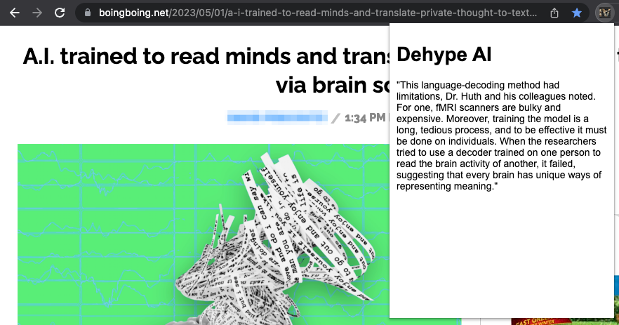

# Dehype AI Chrome Extension

Dehype AI is a Chrome extension that identifies the text of an article that most undermines the title of the article. It uses OpenAI's ChatGPT API to extract a quote from the article that most undermines the hype in the title.




## Setup

1. Clone the repository:

```
k
```

2. Create a `openai-api-key.txt` file in the root directory of the project and add your OpenAI API key.

3. Install the extension in Chrome:

- Open Chrome and navigate to `chrome://extensions/`.
- Enable "Developer mode" by toggling the switch in the top-right corner.
- Click "Load unpacked" and select the `dehype-ai` folder.

## Usage

1. Open a website containing an article related to AI.
2. Click on the Dehype AI extension icon in the Chrome toolbar.
3. A popup will appear with a "Loading summary..." message.
4. After a few seconds, the summary will be displayed in the popup with the hype removed.

## Contributing

Feel free to open issues or submit pull requests to contribute to this project. We appreciate your help in making this extension better!

## License

This project is released under the [MIT License](LICENSE).

## Thank you!
